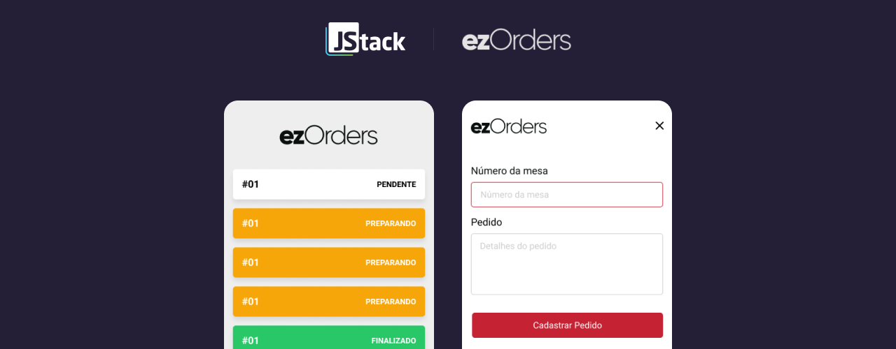

<h1>
  
</h1>

  
  

## **:heavy_plus_sign: Principle functionalities**

- Consume the API to get the orders list
- Create a new order

## **:fire: Principle libraries**

- **expo:** v40.0.0
- **socket.io-client:** v3.1.1
- **styled-components:** v5.2.1
